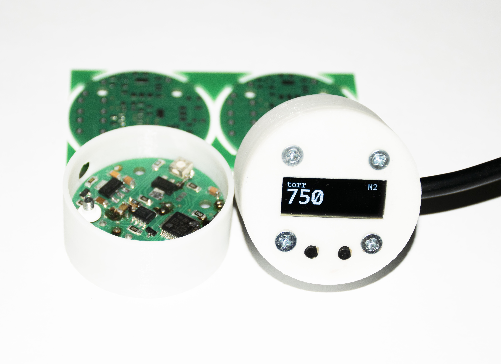
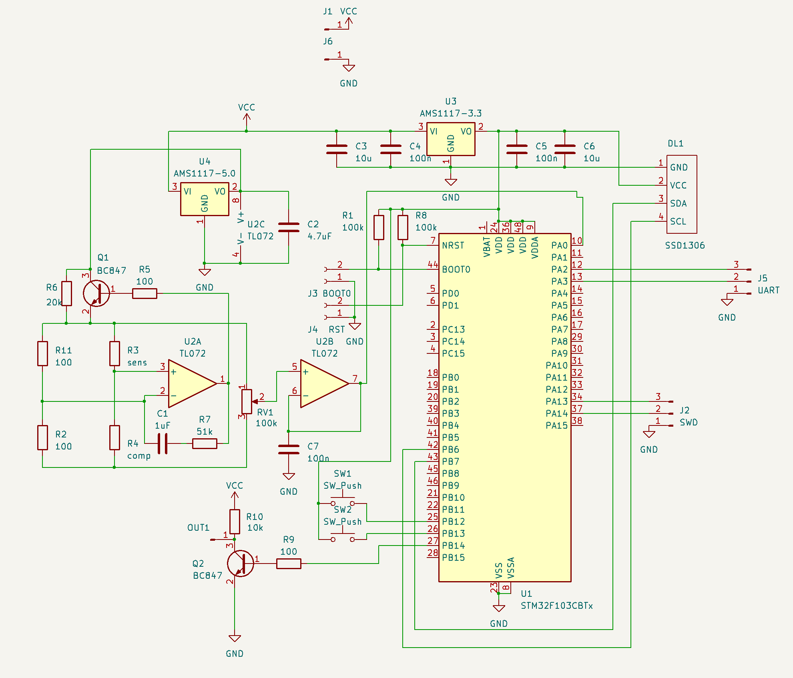
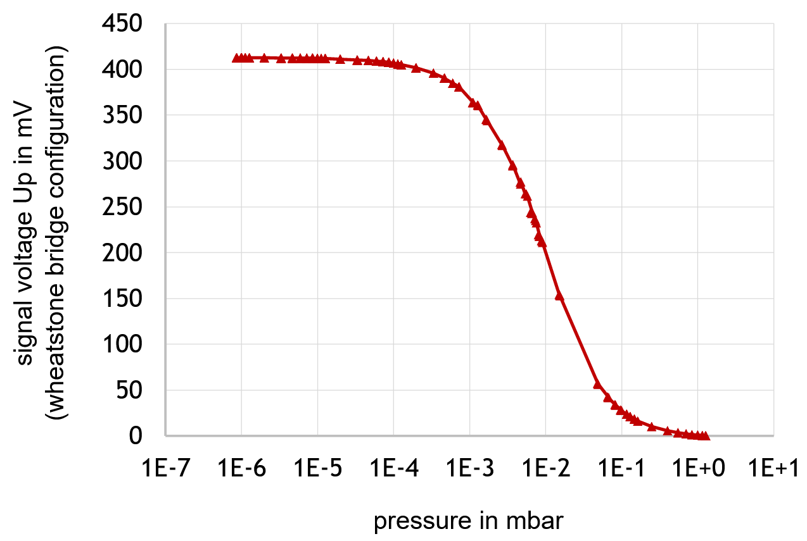
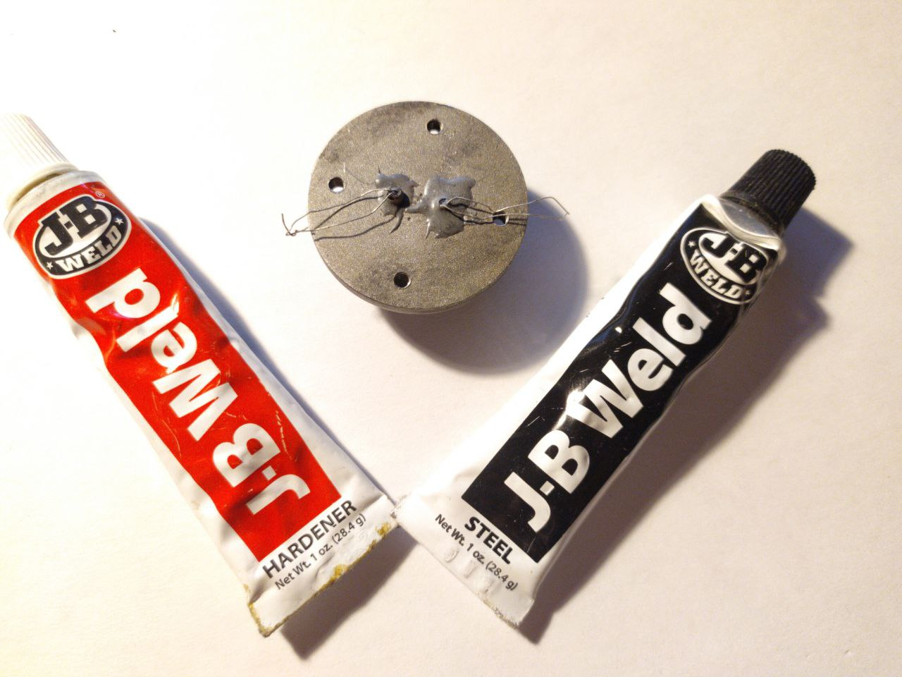

# Micropirani vacuum gauge
> [!CAUTION]
>Please bear in mind that this is **NOT** a finished thing, and I even guarantee that it will **NOT** work if you reproduce it
## What is this

This is an indirect vacuum gauge based on the thermal conductivity measuring.
Supposed to be small, cheap and easy to reproduce by using small incandescent bulbs as the pressure sensor

## How it (doesn't) works

There are a lot of ways of measuring thermal conductivity, as constant current, constant voltage (or more complex) constant resistance, or even constant power stabilisation with measure of changing values.
In this case the thermal conductivity measure is based on measuring the power required to maintain constant resistance of lamp filament.
The first two (in theory) have drawbacks such as low sensitivity in high vacuum, or increased filament burning when air is rushing into the system quickly, and the last one is too complex, so i stopped on the constant resistance method.

The common CR circuit is a Wheatstone bridge with feedback on the OP. When current flows through the resistors with the same value of resistance, they are equally heated. If for some reason the resistance of one of the resistors changes, the bridge leaves the balance and the operational amplifier compensates this by changing the voltage on the bridge, which in this case is being measured.

As the thermal conductivity of vacuum is way higher than thermal conductivity of air, resistor (open bulb filament) is cooled less and maintaining a constant resistance requires less voltage.
To compensate the ambient temperature change, a sealed bulb is connected in series to the opened. It should be placed as close as possible to the sealed bulb. The voltage from the bridge passes through the buffer (it's necessary due to the limitations of the STM's ADC) is measured by the STM32 ADC and converted into pressure.

STM32F103CBT6 with 128 kB of flash is used as an MCU. It's also worth noting that no significant optimizations were made to reduce the code size, but the firmware still fits in the any 64 kB chip. However, due to the absence of the EEPROM, its emulation is realised using the last 127th page of the flash memory. This is an important point, because in reality even 64 kB chip has 128 kB of memory, but its operability is not declared or guaranteed by ST, so, when using smaller chips its necessary to correct the addressing.

A typical calibration curve looks like an S-curve turned on the side. However, it was not possible to find coefficients and/or digitize it with some other function, so i used the usual table and linear interpolation between points

## Now about the mechanical part

Bulbs are glued to the custom lathe-made KF16 flange from the AISI 316 steel (despite the fact it's still a bottleneck for easy reproducing, you can replace it with cheap KF cap with the hole or whatever you want) using JB weld epoxy, which with that small expose area may be considered suitable for high vacuum

## Now about what I did wrong (and why THIS device is worse than a usual voltmeter with CC circuit)

 - As it was found experimentally, when common (12V?) light bulbs are used, the bridge voltage is changes only in range from 1.4 to 2.8 volts, which is the less than half of the ADC range, so accuracy is very low (although pirani sensors are not accurate in general), and most importantly, the lower measurement range is limited to approximately 10^-3 torr (when the theoretical limit is 10^-5 torr). As the solution, bipolar power supply for the OP can be made (in the next revision probably)
 - The dumbest thing was the use of two (!) linear voltage stabilizers and putting them in the same pcb with the bridge resistors - their heat (up to 70 C) was enough to heat the resistors so the readings drift over time and the calibration is lost when the supply voltage changes
 - The sealed (thermal compensation) bulb MUST be placed as close as possible to the open one, but for some reason they were separated by the whole centimeter of metal.
 - The lack of EM shielding causes the MCU malfunctioning near the vacuum pump when the frequency converter is used to drive the motor
 - The thickness of the metal base of the flange was insufficient so the ends of the PCB stands stick out

[![]](https://github.com/irfcx/micropirani/blob/91e39446802804f94227c7d9049f27786a010544/demo.mp4)

## File location

- Kicad pcb and schematic are located in PCB folder
- The main code is located in /source code/Core/Src/source, the main file is micropirani.h
- The compiled firmware binaries are located in /source code/Release
- In case if someone needs it, the fonts are located in /fonts
